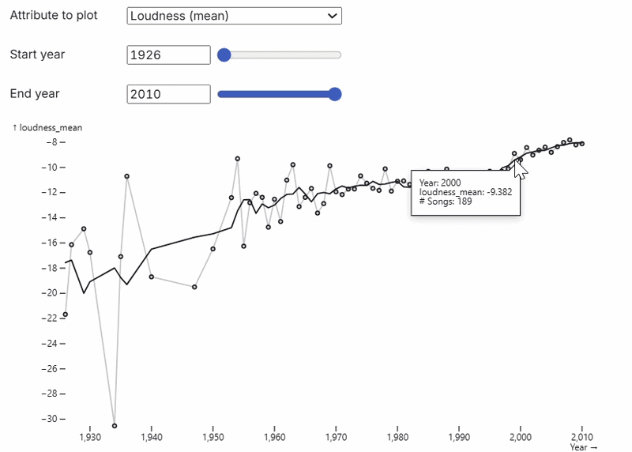

# Music Trends Dashboard

Interactive data visualization dashboard for exploring how music has changed over time using the Million Song Dataset.

---

## Overview

This project analyzes trends in music through measurable audio attributes including tempo, loudness, duration, key, mode, and time signature. Using interactive visualizations, users can explore how these characteristics have changed across different decades and compare musical eras through dynamic filtering and statistical summaries.

The dashboard was built using JavaScript and Observable Plot to transform large-scale music data into an intuitive exploratory analytics tool.

---

## My Contributions

This project was completed as part of CSE 512 at the University of Washington in a partner effort

My contributions:

- Data preprocessing and cleaning
- Exploratory data analysis (EDA)
- Interactive visualization development
- Time-series trend analysis
- Dashboard development

---

## Dataset

**Source:** Million Song Dataset (10,000-song subset)

The dataset contains algorithmically extracted audio features for thousands of songs, including:

- Tempo
- Loudness
- Duration
- Musical Key
- Mode (Major / Minor)
- Time Signature
- Release Year

Dataset:
http://millionsongdataset.com/

---

## Technologies

- JavaScript
- Observable Plot
- D3.js
- HTML
- CSS
- CSV Data Processing

---

## Dashboard Features

- Interactive trend visualization
- Year range filtering
- Audio feature selection
- Era comparison
- Scatter plot analysis
- Interactive tooltips

---

## Workflow

- Data Cleaning
- Data Preprocessing
- Exploratory Data Analysis
- Yearly Aggregation
- Interactive Dashboard Development
- Visualization Design
- Make Insights

---

# Dashboard Preview

## Music Trends Over Time



---

## Distribution Comparison Between Eras


---

## Interactive Scatter Analysis


---

## Repository Structure

```text
music-trends-dashboard/
│
├── data/
│   ├── msd_subset_songs.csv
│   └── msd_subset_yearly.csv
│
├── figures/
│   ├── trend_analysis.gif
│   ├── era_distribution.gif
│   └── scatter_analysis.gif
│
├── README.md
├── index.html
├── index.js
├── runtime.js
├── inspector.css
│
├── df2c1633f8908d14@465.js
├── a2e58f97fd5e8d7c@756.js
├── f3d342db2d382751@886.js
└── 26670360aa6f343b@226.js
```

---

## How to Run

1. Clone this repository.

```bash
git clone https://github.com/yourusername/music-trends-dashboard.git
```

2. Navigate into the project.

```bash
cd music-trends-dashboard
```

3. Install dependencies.

```bash
npm install
```

4. Launch a local server.

```bash
npx http-server
```

5. Open your browser.

```
http://localhost:8080
```

---

## Future Improvements

- Genre-specific trend analysis
- Artist-level comparisons
- Additional interactive filtering options
- Machine learning clustering of musical styles
- Audio similarity exploration

---

## Acknowledgements

This project was completed for **CSE 512** at the **University of Washington**

### Dataset

The visualizations in this project use the **Million Song Dataset (10,000-song subset)**.

If you use this dataset, please cite:

> Bertin-Mahieux, T., Ellis, D. P. W., Whitman, B., & Lamere, P. (2011). *The Million Song Dataset*. Proceedings of the 12th International Society for Music Information Retrieval Conference (ISMIR 2011).

Dataset Website: http://millionsongdataset.com/
